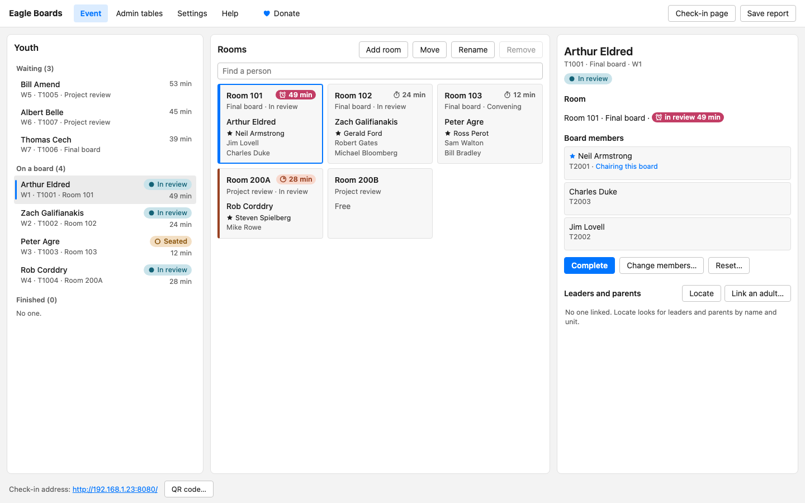
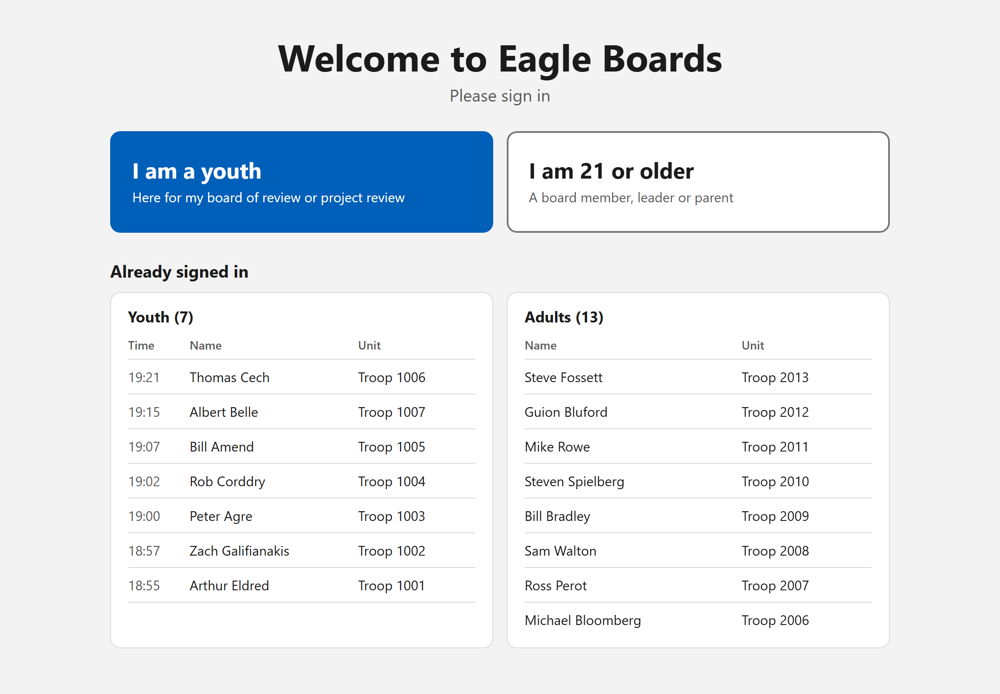
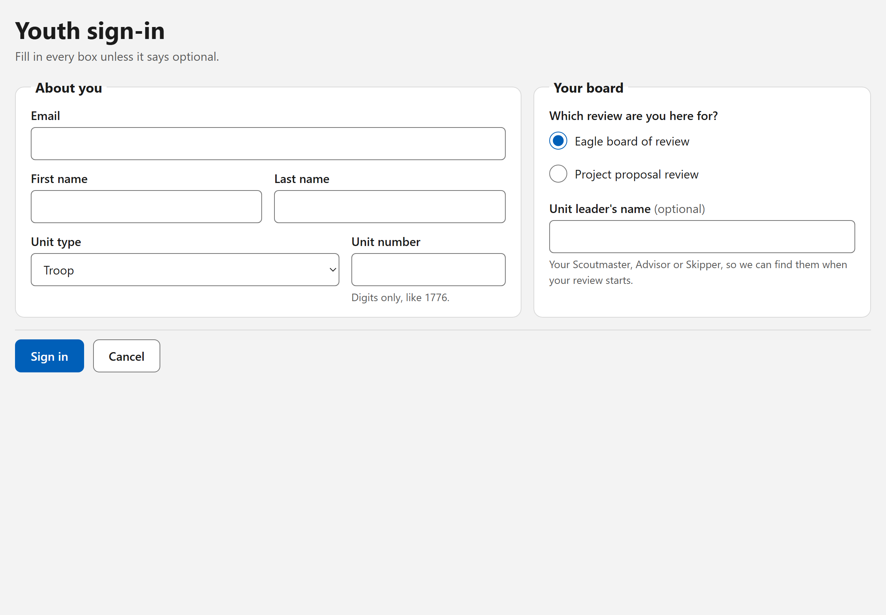
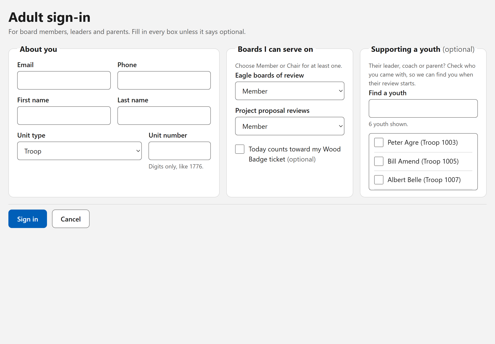
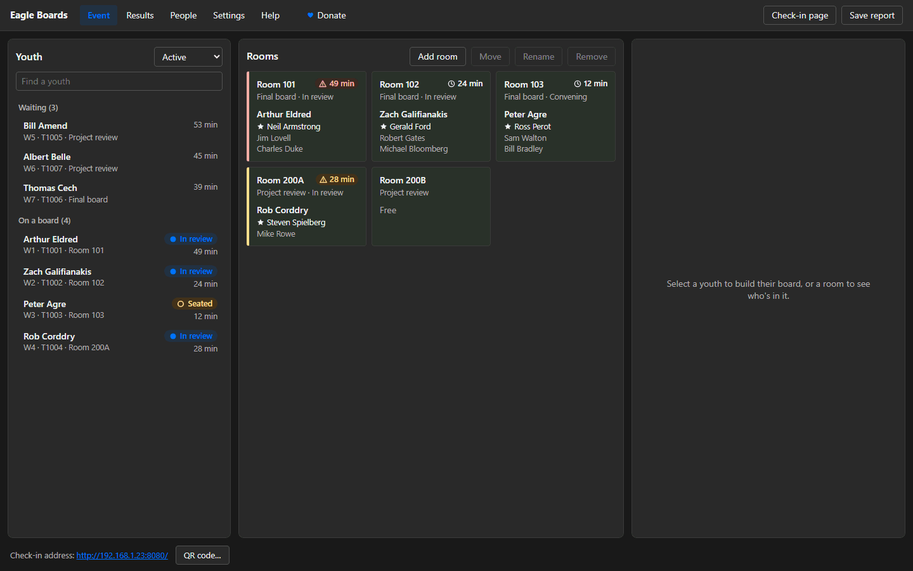
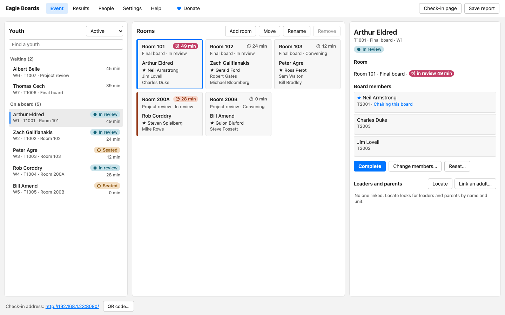
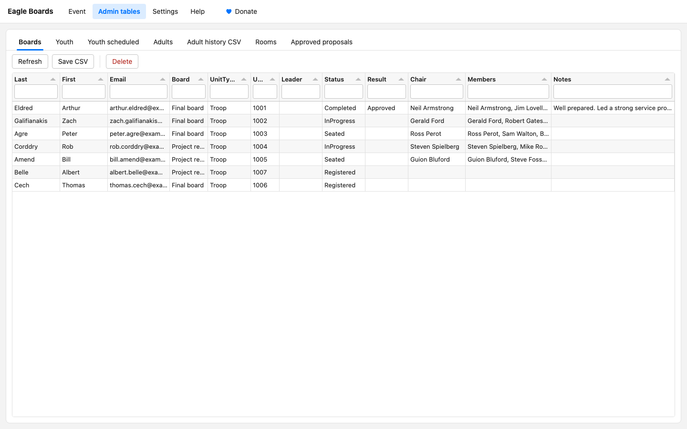
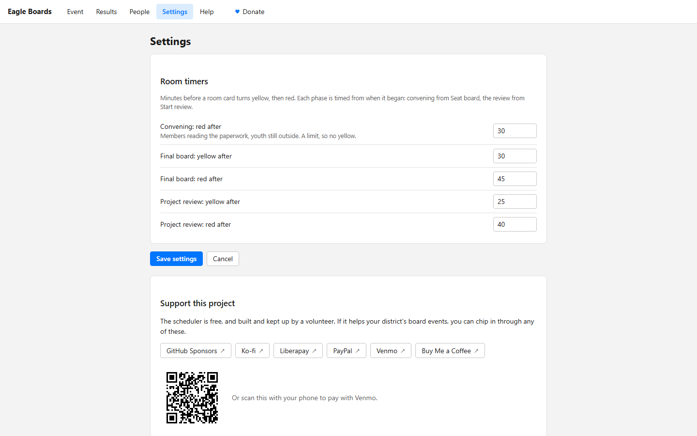

# Eagle Board Scheduler

This program runs the check-in desk and the room assignments at an Eagle Scout
board of review event. Youth and adults sign themselves in on a laptop or
tablet at the door. You sit at the admin computer, put each youth with a board
and a room, and record the result when they come out.

It runs on one computer at the event. It does not need the internet, only a
local network that the check-in station can reach. Every screen, for the door
and for you, is a web page served from that one computer.

<picture>
  <source media="(prefers-color-scheme: dark)" srcset="docs/images/event-dark.png">
  
</picture>

**If you are here to run an event, this page is the whole manual.** The
technical material lives in [RUNNING.md](RUNNING.md). The pictures use a
made-up event whose cast is famous Eagle Scouts; nothing in them is real.

## Before the first event

You need three things.

1. **A computer to run it on.** A laptop is fine. A Raspberry Pi is fine. It
   needs Java installed; see [RUNNING.md](RUNNING.md) if it is not set up yet.
2. **A second screen for the door.** A laptop or tablet with a web browser,
   on the same network as the first computer. This is the check-in station.
3. **Your room list.** Which rooms you have, and whether each one is for
   project proposal reviews or for final boards.

## Starting it up

Open the Eagle Board Scheduler shortcut on the desktop.

Java may ask whether to allow access on local or public networks. Click
**Allow**. If you say no, the check-in station will not be able to reach it.

Two windows open:

- a **black window** full of text. Leave it alone. Closing it stops the program.
- a small **grey window** showing a web address, something like
  `http://192.168.1.50:8080`.

That address is what you type into the check-in station's browser. You can
also open the Event page (below) and press **QR code…** at the bottom: point
the tablet's camera at it and the check-in page opens.

On the admin computer, open the same address with `/scheduler` on the end.
That is the **Event page**, where you will spend the event. The bar across the
top of every page reaches the rest:

| In the top bar | Address | What it is for |
| --- | --- | --- |
| **Event** | the address + `/scheduler` | The youth, the rooms, and building and running each board |
| **Results** | the address + `/admin#boards` | Every youth's board and result, as an editable table |
| **People** | the address + `/admin#adults` | The adults who signed in; promote someone to chair here |
| **Settings** | the address + `/configure` | The room timer times |
| **Help** | the address + `/help` | This manual, in short, inside the program |
| **Check-in page** | the address by itself | What the tablet at the door shows |
| **Save report** | | Saves every youth's board and result as a spreadsheet (CSV) |

The pages follow your computer's light or dark setting. Nothing needs a
refresh: a sign-in at the door, or a change made on another page, shows up at
once.

## Set up your rooms first

Do this before anyone arrives. The program cannot seat a board without a room.

1. On the Event page, press **Add room**.
2. Give the room's name or number, and mark it for **final boards** or
   **project reviews**.

Mark rooms by what you will use them for at this event, not by what they are
called. The program uses that mark to suggest the right room later.

If you run more than one project review in the same physical room, add it more
than once with different names, like `200A` and `200B`. Each one can hold a
board.

Select a room card to act on it: **Rename** renames it (a board already in it
carries on under the new name), **Move** moves its board to another room or
swaps two boards, and **Remove** takes out an empty room. Right-click a room to
switch it between final boards and project reviews. The **Rooms** tab under
Results holds the same list as a table.

## The event, step by step

### 1. People sign in

At the check-in station, a youth taps **I am a youth** and an adult taps
**I am 21 or older**. The lists underneath show who has already signed in.

A youth gives a name, an email address and a unit, picks which review they are
here for, and can name their unit leader. They are never asked for a phone
number or a birthdate. Youth who reserved on SignUpGenius are recognized by
email, and the rest of the form fills itself in.

An adult also gives a phone number and says, for each kind of board, whether
they can serve as a **Member**, as a **Chair**, or not at all. They can tick
that the event counts toward a Wood Badge ticket, and tick the youth they came
to support, so you can find them when that youth's review starts. Adults who
have served before are recognized by email and the form fills itself in.

Each youth appears in the **Youth** list on the Event page the moment they sign
in, numbered `P1, P2…` if they reserved and `W1, W2…` if they walked in. The
list shows the **Active** youth, waiting or on a board. The menu above it
switches to **Waiting**, **On a board**, **Finished** or **Everyone**, and
**Find a youth** narrows it by name, unit or room.

### 2. Check the paperwork

This happens away from the computer. Look over the youth's application,
references, and project workbook while they wait.

If something is missing and cannot be fixed at this event, select the youth
and press **Postpone…**. They can come back another month.

### 3. Seat the board

Select a waiting youth. Their board is built in the details pane on the right:
the program proposes a room, a chair, and the right number of members. It
picks with the whole waiting line in mind, keeping adults who can chair free
for the boards still to come, and puts the adults who have waited longest
first.

You can change any of it:

- **Remove** someone with **×** beside their name, and **add** someone with
  **Add** beside them under **Add members**. **Find an adult** narrows that
  list; tick **Show everyone** to also see adults who are on another board,
  have gone home, or don't serve on this kind of board.
- **Fill the rest** completes the board around the people you chose.
  **Start over** proposes a whole new board.
- **The chair** is the member with **Chair** marked. Only adults who may chair
  this kind of board can be marked.
- **A different room:** choose it under **Room**, or click a free room card.

The rules are checked as you go, under **Board members**:

| What it sees | What happens |
| --- | --- |
| Fewer than 3 members on a final board (2 on a project review) | Refused. Add more adults. |
| More members than needed | Asks you to confirm. This is fine. |
| More than 6 members | Refused. National rules cap a board at six. |
| Nobody who may chair this kind of board | Refused. Promote someone on the People page, or add a qualified chair. |
| Adults from the youth's own unit | Warns you and names them. You may override it. |
| **Every** member from the youth's own unit | Refused. At least one member must come from outside the unit, and there is no override. |
| A final board put in a project room, or the reverse | Asks you to confirm. |

Press **Seat board** (or Ctrl+Enter). The youth is now **Seated**, and the
board members go to the room with the paperwork.

**The youth does not go in yet.** The members read the application, the
references, and the project workbook first. The youth waits outside.

### 4. Start the review

When the members have finished reading, select the youth, or click their room
card.

Under **Leaders and parents**, the details pane lists anyone who came to
support the youth and where they are, so someone can fetch them to walk the
youth in and introduce them. **Locate** also looks for the youth's leaders and
parents by name and unit, and **Link an adult…** records someone who didn't say
so at sign-in.

Once the youth has gone in, press **Start review** (or Ctrl+Enter). The room's
timer starts again from zero, so the reading and the interview are timed
separately.

If someone has to leave a board, or the chair changes hands, press **Change
members…**, remove and add people the same way as when seating, and save. The
room's timer keeps running: it is the same board.

### 5. Record the result

When the board comes out, select the youth and press **Complete** (or
Ctrl+Enter). Choose **Approved**, **Adjourned** (the board postpones its
decision), or **Not approved**, add any notes, and press **Complete**.

That frees the room and the adults for the next youth. The message that follows
names the youth's leaders and parents who have signed in, so they can be told.

### Undo

Every step can be taken back: seating, starting, completing, changing members,
moving or renaming a room, and marking an adult gone home or linking them. Press
**Undo** in the message that follows the step, or Ctrl+Z. **Reset** and
**Postpone** ask first instead.

## Reading the screen

Each youth shows their status as a word with an icon:

| Status | Meaning |
| --- | --- |
| **Waiting** | Signed in, ready to be seated |
| **Seated** | The board is in the room reading the paperwork; the youth is outside |
| **In review** | The youth is in with the board |
| **Completed** | The board is over and its result is recorded |
| **Postponed** | Sent away before a board, usually because the paperwork wasn't in order |

Each room card shows how long its board has been in its current step, with a
stopwatch. When a board is taking a long time the timer shows **running long**
(a timer clock on an orange tint), then **overdue** (an alarm clock on a solid
pink-red fill), so the two differ in shape and lightness as well as color and
read with color blindness. They are a nudge to go and check, not an alarm, and
nothing stops a board that needs longer.

| Step | Running long | Overdue |
| --- | --- | --- |
| Board reading the paperwork (Seated) | — | 30 minutes |
| Final board with the youth | 30 minutes | 45 minutes |
| Project review with the youth | 25 minutes | 40 minutes |

These come from the *Guide to Advancement*, and you can change them on the
Settings page.

## Results and People

**Results** and **People** hold every record as an editable table, in tabs:
Boards, Youth, Youth scheduled (the SignUpGenius reservations), Adults, Adult
history (adults remembered from earlier events, for auto-fill), and Rooms.
Click a cell to change it.

**Correcting a result.** On the Boards tab, change the Result. If the result was
recorded against the wrong youth, give the youth who was actually reviewed the
status Completed, the Result, Chair and Members, and set the other youth's
status back to Registered with the Result, Chair and Members cleared. They can
then be seated for their own board.

**Making someone a chair.** On the People page's Adults tab, change their Final
or Project role to Chair.

## Settings

The room timer times, each explained, and the *Guide to Advancement* passages
the defaults come from.

## When something goes wrong

**A youth is not in the list.** They have not signed in yet, or they signed in
as an adult by mistake. Check the Youth tab under Results, and the menu above
the Youth list: it may be showing only some of them.

**No board proposed, or no room offered.** Every room of that type is busy, or
too few adults have signed in and said they will serve on that kind of board.
Wait for a board to finish, or add a room.

**You seated the wrong board.** Press **Undo** straight away, or select the
youth and press **Reset…**. That puts them back to waiting and frees the adults
and the room. It works whether the board is still reading or already
interviewing.

**You need to postpone after seating.** Press **Reset…** first, then
**Postpone…**.

**An adult has gone home.** With a waiting youth selected, right-click the
adult under **Add members** (tick **Show everyone** if they are not listed) and
choose **Disable (gone home)**. They won't be proposed for another board.
**Enable (back)** returns them.

**The check-in station cannot reach the address.** Both machines must be on the
same network. Check the address in the grey window, and check that you clicked
Allow when Java asked about network access.

**The black window closed.** The program stopped. Start it again from the
shortcut. Work already recorded is saved.

## Where the information goes

Everything is written to files on the computer running the program, in a folder
named for the event's date. Nothing is sent anywhere.

Those files hold the names and emails of adults **and minors**, and the
adults' phone numbers. The program no longer asks a youth for a birthdate or a
phone number, but files from older versions may still hold them. Treat these
files the way you would treat a paper roster: keep them on that machine, do not
email them, and do not put them anywhere shared.

## Support this project

The scheduler is free, and built and kept up by a volunteer. If it helps your
district's board events, you can chip in:
[GitHub Sponsors](https://github.com/sponsors/deekayen) ·
[Ko-fi](https://ko-fi.com/deekayen) ·
[Liberapay](https://liberapay.com/deekayen) ·
[PayPal](https://paypal.me/deekayen) ·
[Venmo](https://venmo.com/drdnorman) ·
[Buy Me a Coffee](https://buymeacoff.ee/deekayen).
The same links are on the scheduler's Settings page.

## For whoever set this up

| Document | What it covers |
| --- | --- |
| [RUNNING.md](RUNNING.md) | Installing, building, command-line options, settings file, known quirks |
| [ARCHITECTURE.md](ARCHITECTURE.md) | How the program is put together |
| [CONTRIBUTING.md](CONTRIBUTING.md) | Making changes, and how they are verified |
| [SECURITY.md](SECURITY.md) | Handling participant data and the API key |
| [PROVENANCE.md](PROVENANCE.md) | Where this code came from |
| [CODE_OF_CONDUCT.md](CODE_OF_CONDUCT.md) | Conduct, on the Scout Oath and Law, and youth protection |

## License

Apache-2.0 (see [LICENSE](LICENSE) and [NOTICE](NOTICE)). The project was
previously GPL-2.0, which the bundled dhtmlxSuite UI library required; that
library has been replaced by MIT-licensed Tabulator, so nothing compels
copyleft any more.

## Trademarks

Not affiliated with, endorsed by, or sponsored by Scouting America (Boy Scouts
of America). "Scouts BSA", "Eagle Scout" and related marks belong to their
owner and are used here only to describe what the software is for. The
interface follows published brand guidance for visual consistency; that is not
a claim of any trademark right, and Apache-2.0 §6 grants none.
